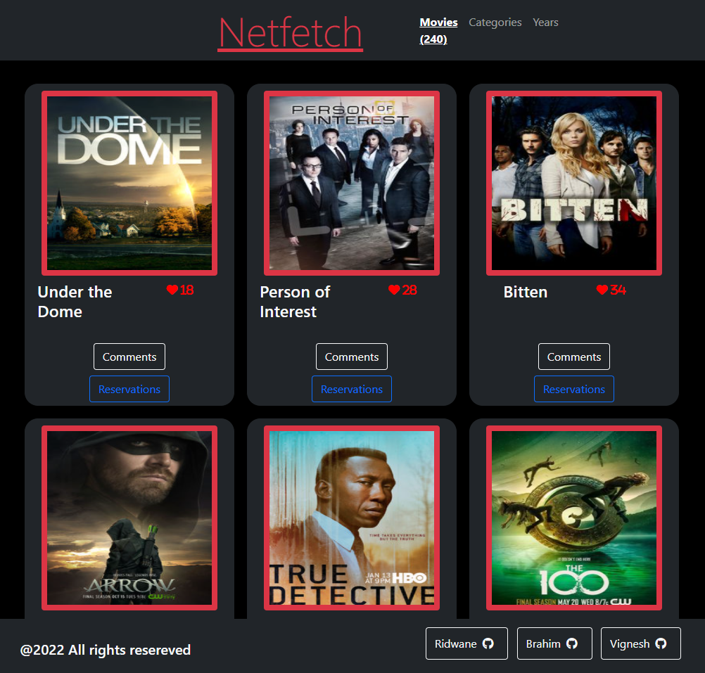

# NetFetch

> NetFetch is website for the latest and favorite TV shows, shipped with a really cool infinite scroll feature!. You can view the details of the show, "like" a show, and even comment. You can also see other comments which might give you a general idea about what people think about the show.
> It is built with HTML, CSS and JavaScript with data from the TvMaze API(tv show data) and the Involvement API(likes and comments)

## Video Presentation

[Presentation Link](https://www.veed.io/view/53b458fa-23f6-4124-b026-92a8b3216e39)

## Live Demo

[Website Link](https://brahimdidi.github.io/netfetch-app/)

## Mini Demo


## Screenshot


Additional description about the project and its features.

## Built With


## Getting Started

To get a local copy up and running follow these simple example steps.

### Prerequisites

- A text editor(preferably Visual Studio Code)

### Install

- [Git](https://git-scm.com/downloads)
- [Node](https://nodejs.org/en/download/)

### Usage

#### Clone this repository

```bash
git clone git@github.com:brahimdidi/Capstone-js.git
cd Capstone-js
```

#### Run project

```bash
 npm install
 npm run start # this will make webpack watching for your changes in code
 npm run test #This is to run the tests on the count method
```

#### Open page in browser

```bash
$ open dist/index.html
```

## Author

👤 **Ridwan Diallo**

- GitHub: [@githubridwan](https://github.com/ridwanediallo)
- Twitter: [@twitterridwan](https://twitter.com/RidwaneD)
- LinkedIn: [LinkedIn](https://www.linkedin.com/in/ridwan-diallo-9a1634193)

👤 **Brahim**

- GitHub: [@githubhandle](https://github.com/brahimdidi)

👤 **Vignesh**

- GitHub: [@vikipretium](https://github.com/vikipretium)
- Twitter: [@vikipretium](https://twitter.com/vikipretium)
- LinkedIn: [vikipretium](https://linkedin.com/in/vikipretium)

Contributions, issues, and feature requests are welcome!

Feel free to check the [issues page](../../issues/).

## Show your support

Give a ⭐️ if you like this project!

## 📝 License

This project is [MIT](./MIT.md) licensed.
